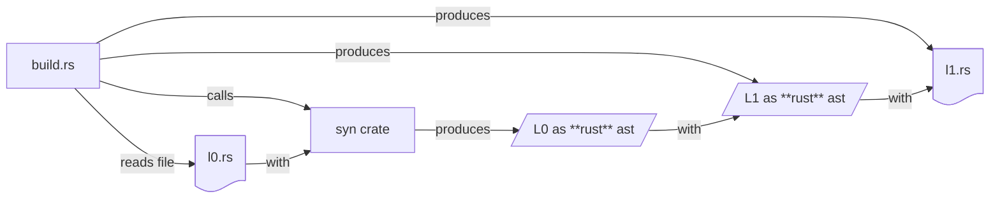

# Exploration of building intermediate languages using Rust Macros

## Problem
This experimental code focuses on solving how to generate intermediate languages for a compiler, in cases where there are many such languages, and each implements little changes from the previous one.

## Solution at a glance

This proposal is not that different from jinja templating but at the level of the Rust AST. That is, the creation of each language is produced by outputting Rust code resulting from the manipulation of Rust code itself (that of the previous language).

## Solution in detail

There are two aspects to it: model creation (for the different intermediate languages), and transformations (for each compiler phase). The first part is the most explored, the second still being in the research phase.

### Model creation

The general idea is to use Rust itself to parse a Rust file to an AST, perform the changes, and output the new Rust code **to a file**. It’s important to note that the artifact is a *file* that we can easily inspect.

Here’s a simple flowchart for the first step, from L0 (the first language, defined elsewhere), to L1, the first intermediate language. Each box is a component / crate, each box with ~ in the bottom part is a file, and every tilted box is an artifact produced by a component. The `with` lines serve to indicate the input that the component uses to produce the next artifact.

The generation of code is part of the [`build.rs`](https://doc.rust-lang.org/cargo/reference/build-scripts.html) script. The steps that the script performs are the following:

 1. It starts by reading the definition file for the first language, `./src/l0.rs`.
 2. With the contents of this file (Rust structures and enums), it parses it with the `syn` crate, and produces the Rust ast representing those structs and enums.
 3. With the generated ast, it introduces the relevant changes and produces the definition for the next language, l1, still as a Rust ast consisting of structs and enums.
 4. With the ast for l1, it produces to write `./generated/l1.rs`.
 5. If there are more languages, the cycle is repeated: it starts reading the previously generated file, parses it, etc.

The example included is a simple expression language, in which expressions like `1 + (2 + 3)` are converted to `+(1, 2, 3)`.

### Transformation

The code also generates a visitor for each language, which can be used, for instance, to make a transformation from an instance of one language to another (representing a pass in the compiler). Ideally, there should be tools to help creating these transformations without having to repeat the tedious work of copying those parts of the tree that are equivalent. This is still TODO.